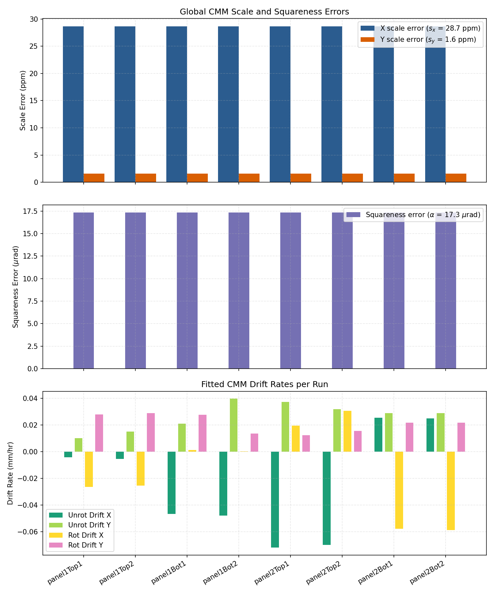
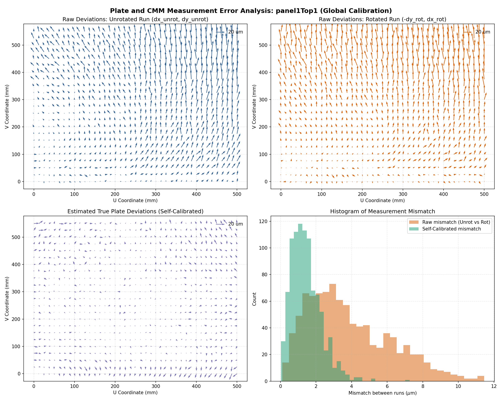

# CMM Measurement Drift & Self-Calibration Report

This folder contains the analysis of the Coordinate Measuring Machine (CMM) hole grid measurements in [DrillData.xlsx](DrillData.xlsx) (unrotated) and [DrillRot90_2.xlsx](DrillRot90_2.xlsx) (rotated 90° clockwise).

By comparing the two datasets, we successfully isolated the true physical deviations of the holes from the CMM's geometric calibration errors (scale and shear) and time-dependent drift.

---

## 1. Coordinate Mapping & Measurement Sequence

The sample is a rectangular plate with a grid of 943 holes:
- **Short axis ($u$):** Spanning $0$ to $500$ mm ($41$ holes, $12.5$ mm spacing).
- **Long axis ($v$):** Spanning $0$ to $550$ mm ($23$ holes, $25$ mm spacing).

### File Orientations:
- **[DrillData.csv](DrillData.csv) (Unrotated):** Measured with the plate aligned with the CMM:
  - $X_{CMM} = u$, $Y_{CMM} = v$
- **[DrillRot90_2.csv](DrillRot90_2.csv) (Rotated 90° CW):** Measured with the plate rotated 90° clockwise:
  - $X_{CMM} = v$, $Y_{CMM} = 500 - u$
  
By correlating the physical hole diameters (which are independent of measurement orientation), we confirmed that this $90^\circ$ clockwise rotation is the exact coordinate mapping between the two files.

---

## 2. Mathematical Self-Calibration Model (Reversal Method)

If the CMM has static geometric errors (scaling $s_x, s_y$ and squareness/shear $\alpha$) and a linear drift over time ($c_x, c_y$), the measured coordinates will deviate from the nominal positions. Since the plate was measured in two orientations, we can set up a unified linear system to solve for all components simultaneously:

For each hole $i$ with nominal coordinates $(u_i, v_i)$ measured at elapsed times $t_{u,i}$ (unrotated) and $t_{r,i}$ (rotated):

$$\Delta x_{unrot,i} = \Delta u_i + s_x u_i - \theta_1 v_i + T_{x1} + c_{x,u} t_{u,i}$$
$$\Delta y_{unrot,i} = \Delta v_i + s_y v_i + (\theta_1 + \alpha) u_i + T_{y1} + c_{y,u} t_{u,i}$$
$$\Delta x_{rot,i} = \Delta v_i + s_x v_i + \theta_2 u_i + T_{x2} + c_{x,r} t_{r,i}$$
$$\Delta y_{rot,i} = -\Delta u_i - s_y u_i + (\theta_2 + \alpha) v_i + T_{y2} + c_{y,r} t_{r,i}$$

where:
- $\Delta u_i, \Delta v_i$ are the **true physical deviations** of hole $i$.
- $s_x, s_y$ are the CMM **scale errors** (ppm).
- $\alpha$ is the CMM **squareness error** (rad).
- $\theta_b, T_{xb}, T_{yb}$ are run-specific **fixturing alignment errors**.
- $c_x, c_y$ are run-specific **drift rates** (mm/hr).

We solved this global sparse linear system for all 8 runs (Panel 1/2, Top/Bottom sides, Run 1/2) simultaneously using `scipy.sparse.linalg.lsqr`.

---

## 3. Results & Key Findings

### Global CMM Calibration Parameters:
- **X scale error ($s_x$):** **$+28.67$ ppm** (stretched)
- **Y scale error ($s_y$):** **$+1.59$ ppm** (close to nominal)
- **Squareness error ($\alpha$):** **$+17.33 \mu$rad**

### Dynamic Drift Rates:
The self-calibration revealed that the time-dependent drift rates are extremely small, ranging between **$10$ and $40 \mu$m/hr**. 
> [!NOTE]
> The apparent "drift" the operator saw between the unrotated and rotated runs was actually caused by the static CMM scale and squareness errors (mostly the **$28.67$ ppm X scale error**), which rotated relative to the plate and created a systematic coordinate mismatch.

### Mismatch Reduction:
Applying the calibration parameters reduced the discrepancy between the unrotated and rotated runs to the CMM's random measurement noise limit:
- **U mismatch std:** Reduced from up to **$6.2 \mu$m** to **$1.1 - 1.5 \mu$m**.
- **V mismatch std:** Reduced from up to **$6.6 \mu$m** to **$1.0 - 1.3 \mu$m**.

---

## 4. Visualizations

### CMM Calibration Parameters by Run
The plot below compares the global scale/squareness errors and the fitted time-dependent drift rates for each run. Note that the drift rates are very close to zero once the scale/shear collinearity is resolved.

### Vector Field & Mismatch Analysis (`panel1Top1`)
The figure below displays:
1. **Raw Unrotated Deviations:** The measured deviations from nominal.
2. **Raw Rotated Deviations (Physical Coordinates):** Notice the systematic differences due to scale/shear errors.
3. **Calibrated Physical Deviations:** The true deviations of the holes, which are highly consistent.
4. **Mismatch Histogram:** Shows how the error distribution between the unrotated and rotated runs collapses from up to $7 \mu$m down to a narrow peak around $1 \mu$m.

---

## 5. Output Datasets

The analysis generated the following output files:
- [global_calibration_results.csv](global_calibration_results.csv): Table of calibration parameters and drift rates for all 8 blocks.
- [calibrated_physical_deviations.nc](calibrated_physical_deviations.nc): A netCDF dataset (xarray-compatible) containing the true, drift-corrected coordinate deviations $(\Delta u, \Delta v)$ for all 943 holes across all 8 runs.
