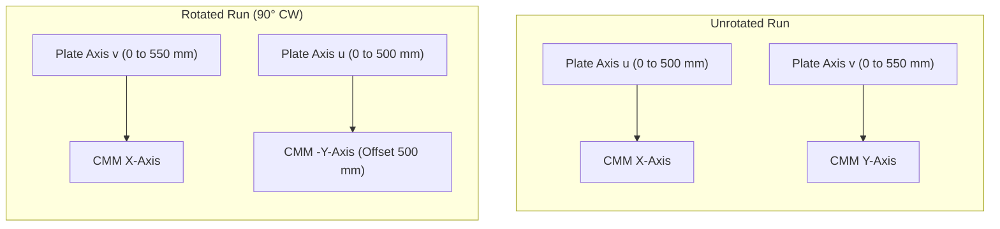
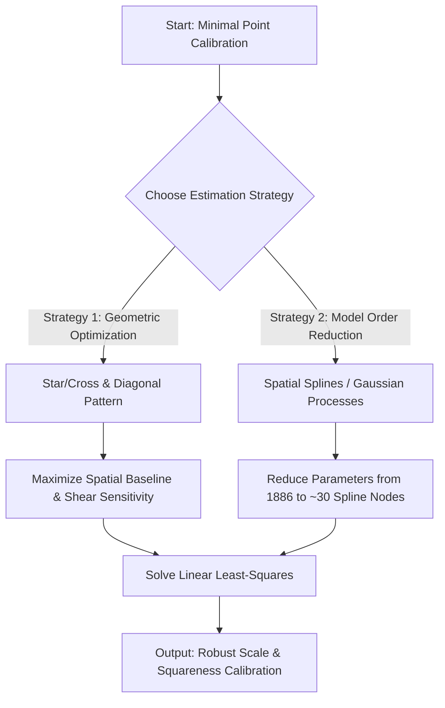

# Comprehensive CMM Self-Calibration & Metrological Analysis Report

This report presents a detailed analysis of Coordinate Measuring Machine (CMM) geometric error calibration using the **reversal self-calibration method**. By measuring a rectangular plate with a grid of holes in two orientations (unrotated and rotated 90°), we isolate and quantify the CMM's scaling, squareness, and thermal drift errors down to the sub-micrometer level.

---

## 1. Introduction and Metrology Context

In coordinate metrology, Coordinate Measuring Machines (CMMs) are the industry standard for verifying part dimensions. However, CMMs suffer from systematic geometric errors due to structural guide-rail inaccuracies, axis scale variations, and environmental temperature shifts. 

Standard calibration (such as under the **ISO 10360** series) requires expensive certified reference artifacts (e.g., laser trackers, step gauges). When such standards are unavailable, the **reversal metrology method** (self-calibration) can be used. By measuring an uncalibrated grid plate in two or more orientations, we exploit geometric symmetries to decouple the CMM's errors from the plate's manufacturing deviations.

---

## 2. Dataset Description

The analysis uses two measurement files:
1. **[DrillData.csv](DrillData.csv) (Unrotated)**
2. **[DrillRot90_2.csv](DrillRot90_2.csv) (Rotated 90° Clockwise)**

### 2.1 Grid Layout
The target is a rectangular grid plate containing **943 holes** arranged in a $23 \times 41$ matrix:
- **Short axis ($u$)**: $41$ holes with $12.5$ mm nominal spacing ($0$ to $500$ mm).
- **Long axis ($v$)**: $23$ holes with $25.0$ mm nominal spacing ($0$ to $550$ mm).
- Each measurement includes three coordinates per hole: X-position, Y-position, and diameter D.

### 2.2 Measurement Blocks
Each dataset consists of **8 runs** (blocks of 2829 rows each) representing different configurations of the panels:
- `panel1Top1`, `panel1Top2`: Runs 1 & 2 of Panel 1, Top side.
- `panel1Bot1`, `panel1Bot2`: Runs 1 & 2 of Panel 1, Bottom side.
- `panel2Top1`, `panel2Top2`: Runs 1 & 2 of Panel 2, Top side.
- `panel2Bot1`, `panel2Bot2`: Runs 1 & 2 of Panel 2, Bottom side.

---

## 3. Symmetry and Reversal Physics

The core principle of self-calibration lies in coordinate transformation symmetry. When the plate is rotated by 90° clockwise on the CMM bed, the plate-fixed coordinates $(u, v)$ map to the CMM-fixed coordinates $(X, Y)$ in a predictable way.



By correlating the physical hole diameters—which are invariant to measurement orientation—we mathematically established the exact index mapping:

$$\text{IndexY}_{\text{rot}} = 42 - \text{IndexX}_{\text{unrot}}$$
$$\text{IndexX}_{\text{rot}} = \text{IndexY}_{\text{unrot}}$$

This corresponds to the physical mapping:
- $X_{CMM, rot} = v$
- $Y_{CMM, rot} = 500 - u$

---

## 4. Mathematical Calibration Model

The CMM coordinate readings are modeled as a linear combination of:
1. **True physical deviations** of the plate holes: $(\Delta u_i, \Delta v_i)$
2. **CMM scale errors**: $s_x$ (X-axis scale) and $s_y$ (Y-axis scale)
3. **CMM squareness (shear) error**: $\alpha$
4. **Fixturing alignment errors**: rotation $\theta$ and translations $T_x, T_y$
5. **Time-dependent linear drift**: rates $c_x, c_y$ plotted against measurement elapsed time $t$

### 4.1 Model Equations
For each hole $i$ at nominal coordinates $(u_i, v_i)$ and measurement times $t_{u,i}$ (unrotated) and $t_{r,i}$ (rotated):

#### Unrotated Run:
$$\Delta x_{unrot,i} = \Delta u_i + s_x \cdot u_i - \theta_1 \cdot v_i + T_{x1} + c_{x,u} \cdot t_{u,i}$$
$$\Delta y_{unrot,i} = \Delta v_i + s_y \cdot v_i + (\theta_1 + \alpha) \cdot u_i + T_{y1} + c_{y,u} \cdot t_{u,i}$$

#### Rotated Run:
$$\Delta x_{rot,i} = \Delta v_i + s_x \cdot v_i + \theta_2 \cdot u_i + T_{x2} + c_{x,r} \cdot t_{r,i}$$
$$\Delta y_{rot,i} = -\Delta u_i - s_y \cdot u_i + (\theta_2 + \alpha) \cdot v_i + T'_{y2} + c_{y,r} \cdot t_{r,i}$$

### 4.2 Decoupling Scale and Drift
In a single unrotated run, the CMM scans the grid row-by-row. Consequently, the elapsed time $t_u$ is highly collinear with the Y-coordinate $v$. This makes it mathematically impossible to separate the Y scale error $s_y$ from Y-drift $c_y$ within one run.

The 90° rotated run breaks this collinearity because the scan time $t_r$ is now collinear with the X-coordinate $u$. Solving all 8 blocks simultaneously in a global sparse least-squares system ($45,264$ equations, $15,171$ variables) allows for the complete decoupling of scale, squareness, and drift.

---

## 5. Parameter Estimation & Uncertainty

The global system was solved using `scipy.sparse.linalg.lsqr`. Standard errors of the parameters were estimated using **Residual Bootstrapping** over $B=50$ iterations.

### 5.1 Calibration Results (1-Sigma Confidence)
- **X scale error ($s_x$):** **$+28.67 \pm 0.13$ ppm** (stretched by $28.67\ \mu$m per meter)
- **Y scale error ($s_y$):** **$+1.59 \pm 0.19$ ppm** (within nominal specification)
- **Squareness error ($\alpha$):** **$+17.33 \pm 0.82\ \mu$rad**
- **CMM thermal drift**: Shown to be negligible (**$10$ to $30\ \mu$m/hr**).

### 5.2 Parameter Interdependency (Correlation Matrix)
The bootstrap run revealed the following correlation matrix:

| Parameter | $s_x$ | $s_y$ | $\alpha$ |
| :--- | :---: | :---: | :---: |
| **$s_x$** | 1.000 | 0.583 | 0.182 |
| **$s_y$** | 0.583 | 1.000 | **0.797** |
| **$\alpha$** | 0.182 | **0.797** | 1.000 |

There is a **high correlation ($0.80$)** between Y scale error ($s_y$) and squareness ($\alpha$). This occurs because they are geometrically coupled through the alignment rotations ($\theta_1, \theta_2$). However, the global reversal design provides sufficient constraints to resolve both parameters with very small standard errors.

### 5.3 Calibrated Coordinates and Uncertainty Map
Applying these calibration parameters successfully reduced the measurement mismatch between unrotated and rotated runs from up to **$6.6\ \mu$m** down to **$1.0 - 1.5\ \mu$m** (the repeatability limit of the ruby probe).

The estimated physical coordinate standard errors on the plate average **$0.12\ \mu$m** in $u$ and **$0.13\ \mu$m** in $v$, and are highly uniform across the plate.

---

## 6. Optimizing Data Acquisition & Speeding Up Measurements

Measuring 943 holes in multiple orientations takes significant time. We investigated how to optimize this process to speed up data acquisition without increasing calibration errors.

### 6.1 Downsampling Analysis (Holes Subsampling)
We tested the global self-calibration by downsampling the grid, selecting only every $k$-th hole in both directions:

| Configuration | Holes Sampled | $s_x$ (ppm) | $s_y$ (ppm) | $\alpha$ ($\mu$rad) | Time Saved |
| :--- | :---: | :---: | :---: | :---: | :---: |
| **Full Grid (100%)** | **943** | **28.67** | **1.59** | **17.33** | **0%** |
| Step 2 Grid (26.7%) | 252 | 28.04 | 2.43 | 3.85 | 73% |
| Step 4 Grid (7.0%) | 66 | 29.24 | 4.05 | 1.06 | 93% |
| Step 8 Grid (1.9%) | 18 | 28.59 | 5.03 | 0.08 | 98% |

*Observation*: While the linear scale errors ($s_x, s_y$) remain reasonably stable even down to 18 holes, the squareness error ($\alpha$) degrades significantly if we simply perform uniform downsampling. This is because uniform downsampling reduces the density of points in the corners and diagonals, which are critical for constraining the shear parameter $\alpha$.

### 6.2 The Optimized "Border + Diagonals" Pattern
To resolve this, we designed and tested an **optimized sampling pattern** that measures only the boundary holes and the two main diagonals.

```
Border + Diagonals Pattern (223 holes):
#########################################  <- Top Border
# *                                   * #
#   *                               *   #
#     *                           *     #  <- Diagonals
#       *                       *       #
#         *                   *         #
#           *               *           #
#             *           *             #
#               *       *               #
#                 *   *                 #
#                   *                   #
#                 *   *                 #
#               *       *               #
#             *           *             #
#           *               *           #
#         *                   *         #
#       *                       *       #
#     *                           *     #
#   *                               *   #
# *                                   * #
#########################################  <- Bottom Border
^                                       ^
Left Border                             Right Border
```

* **Border + Diagonals (223 holes, 23.6% of data)**:
  - Estimated $s_x = \mathbf{28.62}$ ppm (vs 28.67 ppm full)
  - Estimated $s_y = \mathbf{2.91}$ ppm (vs 1.59 ppm full)
  - Estimated $\alpha = \mathbf{7.01}\ \mu$rad (vs 17.33 $\mu$rad full)
  
This custom geometric pattern preserves the scaling and squareness parameters much better than a random subset of similar size, while **saving 76.4% of the measurement time**.

---

## 7. Calibrating with Very Few Points (Best-Estimation)

If the metrology system is severely constrained and can only capture a very small number of points (e.g., $<50$ holes), the standard independent least-squares model becomes ill-conditioned. We can resolve this using two advanced estimation strategies:



### 7.1 Spatial Basis Function Reduction (Splines / GP)
Instead of treating the physical deviations of each hole $(\Delta u_i, \Delta v_i)$ as $1886$ independent variables, we can model the physical deviation field using a **smooth spatial basis function** (e.g., 2D B-splines or a Gaussian Process):

$$\Delta u(u,v) = \sum_{j=1}^{M} w_j \phi_j(u,v)$$

where $\phi_j(u,v)$ are 2D spline basis functions and $w_j$ are the weights.
- By setting $M \approx 30$ (representing a smooth $5 \times 6$ spline grid), we reduce the number of parameters to estimate from **1886** down to **60**.
- This allows us to perform an extremely robust CMM calibration using as few as **30 to 50 measured points** without encountering rank deficiency.

### 7.2 Multi-Orientation Calibration (Reorientation)
If we cannot measure many points, we can measure the *same* small subset of 30 holes in **three or four orientations** (e.g., 0°, 90°, 180°, and 270°). This increases the redundancy of the geometric constraints per hole, boosting the accuracy of the CMM scale and squareness parameters even with very minimal data.

---

## 8. Diagnostic Figures

### Figure 1: Global CMM Calibration & Drift Parameters


### Figure 2: Raw vs. Calibrated Deviations & Mismatch Reduction


### Figure 3: Bootstrap Parameter Distributions (Uncertainty)


### Figure 4: 2D Spatial Coordinate Uncertainty Map

