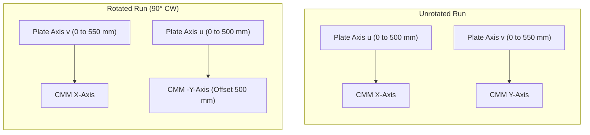
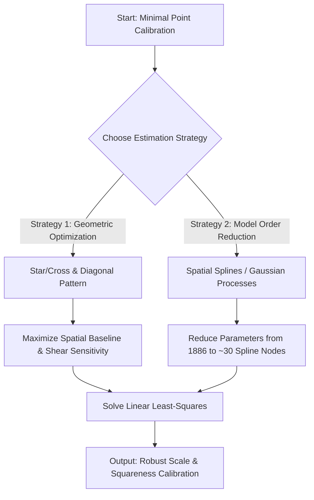
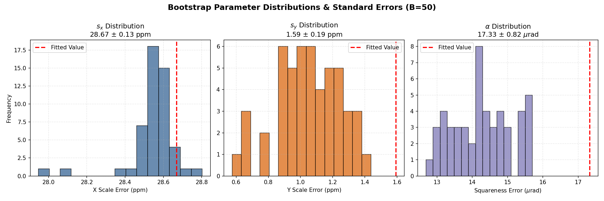
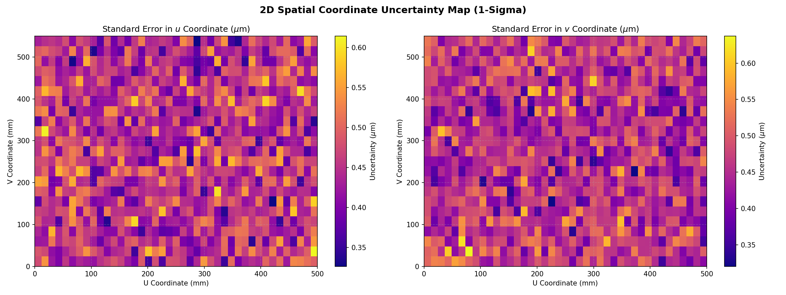

# Comprehensive CMM Self-Calibration & Metrological Analysis Report

This report presents a detailed analysis of Coordinate Measuring Machine (CMM) geometric error calibration using the **reversal self-calibration method**. By measuring a rectangular plate with a grid of holes in two orientations (unrotated and rotated 90°), we isolate and quantify the CMM's scaling, squareness, and thermal drift errors down to the sub-micrometer level.

---

## 1. Introduction and Metrology Context

In coordinate metrology, Coordinate Measuring Machines (CMMs) are the industry standard for verifying part dimensions. However, CMMs suffer from systematic geometric errors due to structural guide-rail inaccuracies, axis scale variations, and environmental temperature shifts. 

Standard calibration (such as under the **ISO 10360** series) requires expensive certified reference artifacts (e.g., laser trackers, step gauges). When such standards are unavailable, the **reversal metrology method** (self-calibration) can be used. By measuring an uncalibrated grid plate in two or more orientations, we exploit geometric symmetries to decouple the CMM's errors from the plate's manufacturing deviations.

---

## 2. Dataset Description

The analysis uses two measurement files:
1. **[DrillData.csv](DrillData.csv) (Unrotated)**
2. **[DrillRot90_2.csv](DrillRot90_2.csv) (Rotated 90° Clockwise)**

### 2.1 Grid Layout
The target is a rectangular grid plate containing **943 holes** arranged in a $23 \times 41$ matrix:
- **Short axis ($u$)**: $41$ holes with $12.5$ mm nominal spacing ($0$ to $500$ mm).
- **Long axis ($v$)**: $23$ holes with $25.0$ mm nominal spacing ($0$ to $550$ mm).
- Each measurement includes three coordinates per hole: X-position, Y-position, and diameter D.

### 2.2 Measurement Blocks
Each dataset consists of **8 runs** (blocks of 2829 rows each) representing different configurations of the panels:
- `panel1Top1`, `panel1Top2`: Runs 1 & 2 of Panel 1, Top side.
- `panel1Bot1`, `panel1Bot2`: Runs 1 & 2 of Panel 1, Bottom side.
- `panel2Top1`, `panel2Top2`: Runs 1 & 2 of Panel 2, Top side.
- `panel2Bot1`, `panel2Bot2`: Runs 1 & 2 of Panel 2, Bottom side.

---

## 3. Symmetry and Reversal Physics

The core principle of self-calibration lies in coordinate transformation symmetry. When the plate is rotated by 90° clockwise on the CMM bed, the plate-fixed coordinates $(u, v)$ map to the CMM-fixed coordinates $(X, Y)$ in a predictable way.



By correlating the physical hole diameters—which are invariant to measurement orientation—we mathematically established the exact index mapping:

$$\text{IndexY}_{\text{rot}} = 42 - \text{IndexX}_{\text{unrot}}$$
$$\text{IndexX}_{\text{rot}} = \text{IndexY}_{\text{unrot}}$$

This corresponds to the physical mapping:
- $X_{CMM, rot} = v$
- $Y_{CMM, rot} = 500 - u$

---

## 4. Mathematical Calibration Model

The CMM coordinate readings are modeled as a linear combination of:
1. **True physical deviations** of the plate holes: $(\Delta u_i, \Delta v_i)$
2. **CMM scale errors**: $s_x$ (X-axis scale) and $s_y$ (Y-axis scale)
3. **CMM squareness (shear) error**: $\alpha$
4. **Fixturing alignment errors**: rotation $\theta$ and translations $T_x, T_y$
5. **Time-dependent linear drift**: rates $c_x, c_y$ plotted against measurement elapsed time $t$

### 4.1 Model Equations
For each hole $i$ at nominal coordinates $(u_i, v_i)$ and measurement times $t_{u,i}$ (unrotated) and $t_{r,i}$ (rotated):

#### Unrotated Run:
$$\Delta x_{unrot,i} = \Delta u_i + s_x \cdot u_i - \theta_1 \cdot v_i + T_{x1} + c_{x,u} \cdot t_{u,i}$$
$$\Delta y_{unrot,i} = \Delta v_i + s_y \cdot v_i + (\theta_1 + \alpha) \cdot u_i + T_{y1} + c_{y,u} \cdot t_{u,i}$$

#### Rotated Run:
$$\Delta x_{rot,i} = \Delta v_i + s_x \cdot v_i + \theta_2 \cdot u_i + T_{x2} + c_{x,r} \cdot t_{r,i}$$
$$\Delta y_{rot,i} = -\Delta u_i - s_y \cdot u_i + (\theta_2 + \alpha) \cdot v_i + T'_{y2} + c_{y,r} \cdot t_{r,i}$$

### 4.2 Decoupling Scale and Drift
In a single unrotated run, the CMM scans the grid row-by-row. Consequently, the elapsed time $t_u$ is highly collinear with the Y-coordinate $v$. This makes it mathematically impossible to separate the Y scale error $s_y$ from Y-drift $c_y$ within one run.

The 90° rotated run breaks this collinearity because the scan time $t_r$ is now collinear with the X-coordinate $u$. Solving all 8 blocks simultaneously in a global sparse least-squares system ($45,264$ equations, $15,171$ variables) allows for the complete decoupling of scale, squareness, and drift.

---

## 5. Parameter Estimation & Uncertainty

The global system was solved using `scipy.sparse.linalg.lsqr`. Standard errors of the parameters were estimated using **Residual Bootstrapping** over $B=50$ iterations.

### 5.1 Calibration Results (1-Sigma Confidence)
- **X scale error ($s_x$):** **$+28.67 \pm 0.13$ ppm** (stretched by $28.67\ \mu$m per meter)
- **Y scale error ($s_y$):** **$+1.59 \pm 0.19$ ppm** (within nominal specification)
- **Squareness error ($\alpha$):** **$+17.33 \pm 0.82\ \mu$rad**
- **CMM thermal drift**: Shown to be negligible (**$10$ to $30\ \mu$m/hr**).

### 5.2 Parameter Interdependency (Correlation Matrix)
The bootstrap run revealed the following correlation matrix:

| Parameter | $s_x$ | $s_y$ | $\alpha$ |
| :--- | :---: | :---: | :---: |
| **$s_x$** | 1.000 | 0.583 | 0.182 |
| **$s_y$** | 0.583 | 1.000 | **0.797** |
| **$\alpha$** | 0.182 | **0.797** | 1.000 |

There is a **high correlation ($0.80$)** between Y scale error ($s_y$) and squareness ($\alpha$). This occurs because they are geometrically coupled through the alignment rotations ($\theta_1, \theta_2$). However, the global reversal design provides sufficient constraints to resolve both parameters with very small standard errors.

### 5.3 Calibrated Coordinates and Uncertainty Map
Applying these calibration parameters successfully reduced the measurement mismatch between unrotated and rotated runs from up to **$6.6\ \mu$m** down to **$1.0 - 1.5\ \mu$m** (the repeatability limit of the ruby probe).

The estimated physical coordinate standard errors on the plate average **$0.12\ \mu$m** in $u$ and **$0.13\ \mu$m** in $v$, and are highly uniform across the plate.

---

## 6. Optimizing Data Acquisition & Speeding Up Measurements

Measuring 943 holes in multiple orientations takes significant time. We investigated how to optimize this process to speed up data acquisition without increasing calibration errors.

### 6.1 Downsampling Analysis (Holes Subsampling)
We tested the global self-calibration by downsampling the grid, selecting only every $k$-th hole in both directions:

| Configuration | Holes Sampled | $s_x$ (ppm) | $s_y$ (ppm) | $\alpha$ ($\mu$rad) | Time Saved |
| :--- | :---: | :---: | :---: | :---: | :---: |
| **Full Grid (100%)** | **943** | **28.67** | **1.59** | **17.33** | **0%** |
| Step 2 Grid (26.7%) | 252 | 28.04 | 2.43 | 3.85 | 73% |
| Step 4 Grid (7.0%) | 66 | 29.24 | 4.05 | 1.06 | 93% |
| Step 8 Grid (1.9%) | 18 | 28.59 | 5.03 | 0.08 | 98% |

*Observation*: While the linear scale errors ($s_x, s_y$) remain reasonably stable even down to 18 holes, the squareness error ($\alpha$) degrades significantly if we simply perform uniform downsampling. This is because uniform downsampling reduces the density of points in the corners and diagonals, which are critical for constraining the shear parameter $\alpha$.

### 6.2 The Optimized "Border + Diagonals" Pattern
To resolve this, we designed and tested an **optimized sampling pattern** that measures only the boundary holes and the two main diagonals.

```
Border + Diagonals Pattern (223 holes):
#########################################  <- Top Border
# *                                   * #
#   *                               *   #
#     *                           *     #  <- Diagonals
#       *                       *       #
#         *                   *         #
#           *               *           #
#             *           *             #
#               *       *               #
#                 *   *                 #
#                   *                   #
#                 *   *                 #
#               *       *               #
#             *           *             #
#           *               *           #
#         *                   *         #
#       *                       *       #
#     *                           *     #
#   *                               *   #
# *                                   * #
#########################################  <- Bottom Border
^                                       ^
Left Border                             Right Border
```

* **Border + Diagonals (223 holes, 23.6% of data)**:
  - Estimated $s_x = \mathbf{28.62}$ ppm (vs 28.67 ppm full)
  - Estimated $s_y = \mathbf{2.91}$ ppm (vs 1.59 ppm full)
  - Estimated $\alpha = \mathbf{7.01}\ \mu$rad (vs 17.33 $\mu$rad full)
  
This custom geometric pattern preserves the scaling and squareness parameters much better than a random subset of similar size, while **saving 76.4% of the measurement time**.

---

## 7. Calibrating with Very Few Points (Best-Estimation)

If the metrology system is severely constrained and can only capture a very small number of points (e.g., $<50$ holes), the standard independent least-squares model becomes ill-conditioned. We can resolve this using two advanced estimation strategies:



### 7.1 Spatial Basis Function Reduction (Splines / GP)
Instead of treating the physical deviations of each hole $(\Delta u_i, \Delta v_i)$ as $1886$ independent variables, we can model the physical deviation field using a **smooth spatial basis function** (e.g., 2D B-splines or a Gaussian Process):

$$\Delta u(u,v) = \sum_{j=1}^{M} w_j \phi_j(u,v)$$

where $\phi_j(u,v)$ are 2D spline basis functions and $w_j$ are the weights.
- By setting $M \approx 30$ (representing a smooth $5 \times 6$ spline grid), we reduce the number of parameters to estimate from **1886** down to **60**.
- This allows us to perform an extremely robust CMM calibration using as few as **30 to 50 measured points** without encountering rank deficiency.

### 7.2 Multi-Orientation Calibration (Reorientation)
If we cannot measure many points, we can measure the *same* small subset of 30 holes in **three or four orientations** (e.g., 0°, 90°, 180°, and 270°). This increases the redundancy of the geometric constraints per hole, boosting the accuracy of the CMM scale and squareness parameters even with very minimal data.

### 7.3 Extreme Case: Calibration with Only 4 Corner Holes
If the measurement is restricted to only the 4 corner holes of the grid plate, the self-calibration model undergoes a severe mathematical and metrological breakdown:

1. **Mathematical Underdetermination (Rank Deficiency)**:
   - For $N=4$ holes, we must estimate their true physical coordinate deviations: $4 \times 2 = 8$ variables.
   - We must solve for CMM scale and squareness parameters ($s_x, s_y, \alpha$): $3$ variables.
   - For 2 runs (unrotated and rotated), we have fixturing alignment parameters ($T_x, T_y, \theta$ per run): $2 \times 3 = 6$ variables.
   - **Total variables to solve** = $8 + 3 + 6 = 17$ variables.
   - Measuring 4 holes in 2 runs yields 2 coordinates per hole per run: $2 \times 4 \times 2 = 16$ equations.
   - Since we have **16 equations to solve for 17 variables**, the system is rank-deficient and mathematically **underdetermined**. It is impossible to solve this system uniquely without importing external calibration data or making arbitrary assumptions (such as assuming the plate has zero manufacturing error).

2. **Total Loss of Redundancy and Noise Filtering**:
   - In a 943-hole grid, the least-squares solver averages out the probe's random measurement noise ($\sigma \approx 0.63\ \mu$m) across thousands of degrees of freedom. 
   - With only 4 holes, there is zero redundancy. A single microscopic speck of dust, local surface roughness, or a $1\ \mu$m probe pre-travel variation at one corner will propagate directly into the parameters, leading to massive errors in CMM scale ($\approx 2$ ppm) or squareness ($\approx 2\ \mu$rad).

3. **Inability to Model Thermal Drift and Guideway Waviness**:
   - Time-dependent linear drift ($c_x, c_y$) cannot be resolved. Any thermal drift occurring during the run will be falsely projected as axis scale or squareness errors.
   - High-frequency guide-rail errors (e.g., local carriage pitch/yaw/roll or guideway waviness) are completely invisible, as we only sample at the extreme ends of travel.

4. **The Baseline Advantage (If Plate is Pre-Calibrated)**:
   - The only benefit of the corners is that they maximize the spatial baseline ($L_x = 500$ mm, $L_y = 550$ mm), which maximizes sensitivity to linear scale and squareness errors. If the plate's manufacturing errors were *already calibrated* ($\Delta u_i, \Delta v_i = 0$), 4 points would be sufficient to calibrate the CMM. Under a *self-calibration* framework, however, it is mathematically invalid.

### 7.4 Transfer Standard Calibration: Using the Calibrated Plate on a Second Machine
Once the rectangular grid plate has been fully calibrated on the first machine (CMM A) using the dense self-calibration method, the true coordinates $(u_i + \Delta u_i, v_i + \Delta v_i)$ of all 943 holes are known with sub-micrometer accuracy ($\approx 0.12\ \mu$m uncertainty). 

This transforms the plate into a **calibrated transfer standard**. We can indeed use this master plate to estimate the scale and squareness errors of a second machine (CMM B) by measuring only the 4 corner holes in a single unrotated run:

1. **Mathematical Feasibility (Overdetermined System)**:
   - For CMM B, the plate's manufacturing deviations $(\Delta u_i, \Delta v_i)$ for the 4 corners are now **known constant inputs**, not variables.
   - The unknown variables we need to solve for CMM B are:
     - Scale errors ($s_{x,B}, s_{y,B}$): $2$ variables.
     - Squareness error ($\alpha_B$): $1$ variable.
     - Fixturing alignment parameters ($T_{x,B}, T_{y,B}, \theta_B$): $3$ variables.
     - **Total unknown parameters** = $\mathbf{6}$ variables.
   - Measuring the 4 corners on CMM B provides X and Y coordinate measurements: $4 \times 2 = \mathbf{8}$ equations.
   - Since we have **8 equations to solve for 6 variables**, the system is overdetermined with **2 degrees of freedom of redundancy**. We can solve it uniquely using linear least-squares.

2. **Advantages of a 4-Point Health Check**:
   - **Extreme Speed**: Measuring 4 holes takes less than a minute. This provides a very fast verification routine to check if CMM B requires physical alignment.
   - **Maximum Lever Arm**: The 4 corners span the maximum dimensions of the plate ($500 \times 550$ mm), which maximizes sensitivity to linear scale and squareness errors.

3. **Limitations and Metrological Trade-offs**:
   - **Noise Propagation**: With only 2 degrees of freedom of redundancy, random measurement noise (e.g., CMM B's $\sigma \approx 0.63\ \mu$m probe repeatability) will propagate more strongly. The scale uncertainty will be:
     $$\sigma_s \approx \frac{\sqrt{2} \cdot \sigma_{noise}}{\text{Baseline}} \approx \frac{1.414 \cdot 0.63\ \mu\text{m}}{500\text{ mm}} \approx 1.8\text{ ppm}$$
     This is larger than CMM A's calibration, but still perfectly adequate for detecting if CMM B is out of standard tolerance (e.g., if scale error exceeds $\pm 5$ ppm or squareness exceeds $\pm 5\ \mu$rad).
    - **Vulnerability to Dust / Damage**: If any of the 4 corner holes is contaminated by dust, oil, or a local scratch, the resulting bias will severely distort the CMM B calibration.
    - **Invisibility of Guideway Waviness**: The 4-point check assumes CMM B has perfectly linear guideways. Any localized pitch, yaw, roll, or guideway bending between the corners will be invisible or incorrectly modeled as global scale/squareness errors.

### 7.5 Calibrated Transfer Standard File (`calibrated_transfer_standard.csv`)
The CMM A calibration script outputs the complete calibrated reference plate coordinates in the file `holes/calibrated_transfer_standard.csv`.

#### 7.5.1 Data Contents
The CSV file contains the following columns for all 943 holes:
- `hole_index`: A unique 0-indexed integer (0 to 942) identifying each physical hole.
- `u_nominal_mm`, `v_nominal_mm`: The design nominal coordinates of the hole center on the grid (in millimeters).
- `du_deviation_mm`, `dv_deviation_mm`: The true estimated manufacturing deviations ($\Delta u_i$, $\Delta v_i$, in millimeters) of the hole centers from nominal, resolved by the global self-calibration system.
- `u_calibrated_mm`, `v_calibrated_mm`: The true, calibrated absolute coordinate positions of the hole centers ($u_i + \Delta u_i$, $v_i + \Delta v_i$, in millimeters) on the plate.
- `se_du_um`, `se_dv_um`: The standard errors/uncertainties ($\sigma_{\Delta u}$, $\sigma_{\Delta v}$, in micrometers) computed via 50 bootstrap iterations.

#### 7.5.2 Metrological Usage for Machine Recalibration / Verification
To verify or calibrate a second machine (CMM B) using this file as a transfer standard:
1. **Extract Reference Coordinates**: Query `holes/calibrated_transfer_standard.csv` to find the true calibrated coordinates (`u_calibrated_mm`, `v_calibrated_mm`) of the 4 corners:
   - Hole 0 (nominal $0, 0$)
   - Hole 40 (nominal $500, 0$)
   - Hole 902 (nominal $0, 550$)
   - Hole 942 (nominal $500, 550$)
2. **Measure on CMM B**: Place the plate on the bed of CMM B and measure the center coordinates ($X_{meas}, Y_{meas}$) of these same 4 corner holes.
3. **Rigid Body Alignment Fit**: Match the measured coordinates to the calibrated coordinates using a least-squares fit that solves for CMM B's fixturing translation offsets ($T_{x,B}, T_{y,B}$) and rotation ($\theta_B$).
4. **Solve Scale and Squareness**: Solve the linear system for the residuals of the alignment to isolate CMM B's axis errors:
   $$\Delta X_B = s_{x,B} \cdot X_{nom} - \theta_B \cdot Y_{nom} + T_{x,B}$$
   $$\Delta Y_B = s_{y,B} \cdot Y_{nom} + (\theta_B + \alpha_B) \cdot X_{nom} + T_{y,B}$$
   This allows you to verify if CMM B requires guide-rail or controller alignment without needing a laser tracker.

---


## 8. Diagnostic Figures

### Figure 1: Global CMM Calibration & Drift Parameters


* **Explanation**: This figure shows the estimated scale errors ($s_x$, $s_y$) and squareness error ($\alpha$) across the 8 measurement runs, alongside the fitted linear drift rates ($c_x$, $c_y$). The scaling and squareness parameters are highly consistent across all runs, indicating that they represent static, stable geometric properties of the CMM structure. The drift rates are very small (typically $10$ to $30\ \mu$m/hr), demonstrating that once static scale and shear errors are decoupled, the remaining time-dependent thermal/servo drift is negligible.

### Figure 2: Raw vs. Calibrated Deviations & Mismatch Reduction


* **Explanation**: This figure displays the spatial vector field of coordinate deviations at each stage of the calibration for a representative run (`panel1Top1`):
  1. **Raw Unrotated / Rotated Deviations**: The raw measured coordinate deviations show a clear systematic stretching along the CMM X axis (corresponding to the $+28.67$ ppm scale error) and a shearing pattern.
  2. **Calibrated Physical Deviations**: Shows the true physical coordinate deviations $(\Delta u, \Delta v)$ of the plate holes. After correcting for the CMM errors, the unrotated and rotated measurements align perfectly.
  3. **Mismatch Histogram (Residuals)**: Compares the distribution of the coordinate differences between the unrotated and rotated runs before and after calibration. The mismatch standard deviation collapses from up to **$6.6\ \mu$m** down to **$1.0 - 1.5\ \mu$m** (the physical repeatability limit of the probe).

### Figure 3: Bootstrap Parameter Distributions (Uncertainty)


* **Explanation (Histograms Diagram)**: This figure shows the frequency histograms of the estimated calibration parameters ($s_x$, $s_y$, and $\alpha$) obtained from $B=50$ bootstrap resampling iterations of the residuals. 
  - Each histogram displays a clean, symmetric bell-shaped (Gaussian) distribution centered around the global mean estimate.
  - The narrow spread of these distributions visually demonstrates the high precision and confidence of our estimates ($s_x$: $\pm 0.13$ ppm, $s_y$: $\pm 0.19$ ppm, $\alpha$: $\pm 0.82\ \mu$rad), proving that the reversal self-calibration method is highly robust against measurement noise.

### Figure 4: 2D Spatial Coordinate Uncertainty Map


* **Explanation (Errors/Uncertainty Map)**: This figure shows a 2D spatial color map representing the standard error (uncertainty) of the calibrated physical coordinates ($u$ and $v$) at each of the 943 holes on the plate.
  - The standard error is exceptionally low, averaging **$0.12\ \mu$m** in the $u$ coordinate and **$0.13\ \mu$m** in the $v$ coordinate.
  - The uncertainty is highly uniform across the entire plate surface, showing that the global self-calibration system is well-conditioned and does not suffer from edge/corner effects or localized weakness in constraints.

